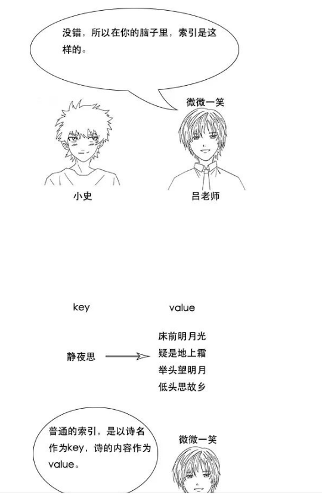
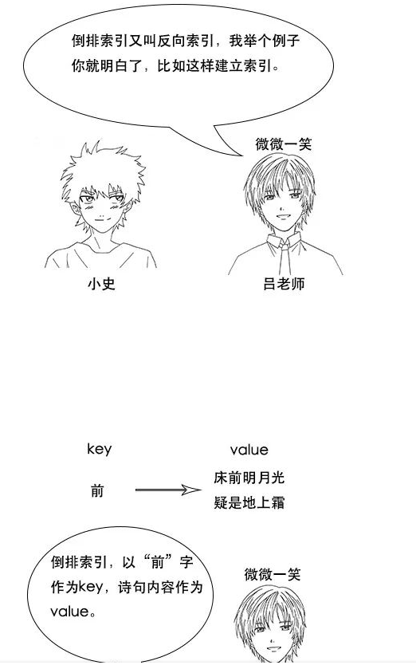

# Elasticsearch

我们生活中的数据总体分为两种：

 - 结构化数据：指具有固定格式或有限长度的数据，如数据库，元数据等。
 - 非结构化数据：非结构化数据又可称为全文数据，指不定长或无固定格式的数据，如邮件，Word 文档等。
 
so save storage

 - SQL   : mysql
 - nosql : redis memecache
 
根据两种数据分类，搜索也相应的分为两种：

 - 结构化数据搜索           SQL
 - 非结构化数据搜索         顺序扫描/全文检索
 
顺序扫描: 顺序扫描很慢 
全文检索：将非结构化数据中的一部分信息提取出来，重新组织，使其变得有一定结构，然后对此有一定结构的数据进行搜索，从而达到搜索相对较快的目的。
这种方式就构成了全文检索的基本思路。这部分从非结构化数据中提取出的然后重新组织的信息，我们称之索引。
                    
对这些关键字建立索引  

    key : "EDG"，"RNG"
    value: {
        "S8 全球总决赛的新闻",
        "EDG vs RNG",
    }

索引我们就可以对应到该关键词出现的`article`

#### 为什么要用全文搜索搜索引擎

为什么要用搜索引擎？

我们的所有数据在数据库里面都有，而且`Oracle`、`SQL Server` 等数据库里也能提供查询检索或者聚类分析功能，直接通过数据库查询不就可以了吗？

确实，我们大部分的查询功能都可以通过数据库查询获得，如果查询效率低下，还可以通过建数据库索引，优化 SQL 等方式提升效率，甚至通过引入缓存来加快数据的返回速度。
如果数据量更大，就可以分库分表来分担查询压力。

那为什么还要全文搜索引擎呢？我们主要从以下几个原因分析：

数据类型

全文索引搜索支持非结构化数据的搜索，可以更好地快速搜索大量存在的任何单词或单词组的非结构化文本。
例如 Google，百度类的网站搜索，它们都是根据网页中的关键字生成索引，我们在搜索的时候输入关键字，它们会将该关键字即索引匹配到的所有网页返回；
还有常见的项目中应用日志的搜索等等。对于这些非结构化的数据文本，关系型数据库搜索不是能很好的支持。

#### 什么时候使用全文搜索引擎：

such as : we need search a word in some value in reids key:value pair
     
 - 搜索的数据对象是大量的非结构化的文本数据。
 - 文件记录量达到数十万或数百万个甚至更多。
 - 支持大量基于交互式文本的查询。
 - 需要非常灵活的全文搜索查询。
 - 对高度相关的搜索结果有特殊需求，但是没有可用的关系数据库可以满足。
 - 对不同记录类型、非文本数据操作或安全事务处理的需求相对较少的情况。

use which one ？

记住下面这些要点：

 - 由于易于使用，Elasticsearch 在新开发者中更受欢迎。但是，如果您已经习惯了与 Solr 合作，请继续使用它，因为迁移到 Elasticsearch 没有特定的优势。
 - 如果除了搜索文本之外还需要它来处理分析查询，Elasticsearch 是更好的选择。
 - 如果需要分布式索引，则需要选择 Elasticsearch。对于需要良好可伸缩性和性能的云和分布式环境，Elasticsearch 是更好的选择。
 - 两者都有良好的商业支持（咨询，生产支持，整合等）。
 - 两者都有很好的操作工具，尽管 Elasticsearch 因其易于使用的 API 而更多地吸引了 DevOps 人群，因此可以围绕它创建一个更加生动的工具生态系统。
 - Elasticsearch 在开源日志管理用例中占据主导地位，许多组织在 Elasticsearch 中索引它们的日志以使其可搜索。虽然 Solr 现在也可以用于此目的，但它只是错过了这一想法。
 - Solr 仍然更加面向文本搜索。另一方面，Elasticsearch 通常用于过滤和分组，分析查询工作负载，而不一定是文本搜索。
 - Elasticsearch 开发人员在 Lucene 和 Elasticsearch 级别上投入了大量精力使此类查询更高效(降低内存占用和 CPU 使用)。
 - 因此，对于不仅需要进行文本搜索，而且需要复杂的搜索时间聚合的应用程序，Elasticsearch 是一个更好的选择。
 - Elasticsearch 更容易上手，一个下载和一个命令就可以启动一切。Solr 传统上需要更多的工作和知识，但 Solr 最近在消除这一点上取得了巨大的进步，现在只需努力改变它的声誉。
 - 在性能方面，它们大致相同。我说“大致”，因为没有人做过全面和无偏见的基准测试。对于 95％ 的用例，任何一种选择在性能方面都会很好，剩下的 5％ 需要用它们的特定数据和特定的访问模式来测试这两种解决方案。
 - 从操作上讲，Elasticsearch 使用起来比较简单，它只有一个进程。Solr 在其类似 Elasticsearch 的完全分布式部署模式 SolrCloud 中依赖于 Apache ZooKeeper，ZooKeeper 是超级成熟，超级广泛使用等等，但它仍然是另一个活跃的部分。
 - 也就是说，如果您使用的是 Hadoop，HBase，Spark，Kafka 或其他一些较新的分布式软件，您可能已经在组织的某个地方运行 ZooKeeper。
 - 虽然 Elasticsearch 内置了类似 ZooKeeper 的组件 Xen，但 ZooKeeper 可以更好地防止有时在 Elasticsearch 集群中出现的可怕的裂脑问题。
 - 公平地说，Elasticsearch 开发人员已经意识到这个问题，并致力于改进 Elasticsearch 的这个方面。
 - 如果您喜欢监控和指标，那么使用 Elasticsearch，您将会进入天堂。这个东西比新年前夜在时代广场可以挤压的人有更多的指标！Solr 暴露了关键指标，但远不及 Elasticsearch 那么多。

#### 主流的搜索引擎

 - Lucene  : Java
 - Solr    : Java 
 - ElasticSearch : RESTful 搜索引擎
 
它们的索引建立都是根据`倒排索引`的方式生成索引.

正排索引：

正排索引是指文档ID为key，表中记录每个关键词出现的次数，查找时扫描表中的每个文档中字的信息，直到找到所有包含查询关键字的文档。

倒排索引：

由于正排的耗时太长缺点，倒排就正好相反，是以word作为关键索引,表中关键字所对应的记录表项记录了出现这个字或词的所有文档，
一个表项就是一个字表段，它记录该文档的ID和字符在该文档中出现的位置情况。
它是文档检索系统中最常用的数据结构。

吕老师：但是我让你说出带“前”字的诗句，由于没有索引，你只能遍历脑海中所有诗词，当你的脑海中诗词量大的时候，就很难在短时间内得到结果了。

倒排包含两部分：

 1. 由不同的索引词（index term）组成的索引表，称为“词典”（lexicon）。其中包含了各种词汇，以及这些词汇的统计信息（如出现频率nDocs），这些统计信息可以直接用于各种排名算法。
 2. 由每个索引词出现过的文档集合，以及命中位置等信息构成。也称为“记录表”。就是正排索引产生的那张表。当然这部分可以没有。具体看自己的业务需求了。
 
倒排的优缺点和正排的优缺点整好相反。

 - **倒排在构建索引的时候较为耗时且维护成本较高，但是搜索耗时短**。
 - **正排在构建索引的时候耗时短，但是搜索较为耗时**。
 
#### Elasticsearch usage scene

1. 日志收集/解析和分析  

ELK 日志分析系统

 - E Elasticsearch
 - L 是 Logstash，是一个日志收集系统
 - K 是 Kibana，是一个数据可视化平台

分析日志的用处可大了，你想，假如一个分布式系统有 1000 台机器，系统出现故障时，我要看下日志，还得一台一台登录上去查看，是不是非常麻烦？
 
2. 搜索

3. 把ElasticSearch当成是NoSQL数据库可以吗？

如果本文描述的这些限制都不能阻止你，你当然可以使用Elasticsearch作为主存储库。
Elasticsearch通常被用作其它数据库的补充。那样的数据库系统要有强大的数据约束保证、容错性和鲁棒性、高可用性和带事务支持的数据更 新能力，它维护着核心数据. 
这些数据随后会被异步推送到Elasticsearch中去(也可能是抽取，前提是你使用了Elasticsearch的某一种“rivers”)。

3. 海量日志数据存储用 elasticsearch 和 hbase 哪个好 ? 

elasticsearch

 - 支持海量数据存储
 - 查询复杂度 ES提供了丰富的查询语法，支持对多种类型的精确匹配、模糊匹配、范围查询、聚合等操作，ES对字段做了反向索引，即使在亿级数据量下还可以达到秒级的查询响应速度。
 - 字段扩展性 es可以通过动态字段方便地对字段进行扩展
 
如果主要做实时、动态的计数，则推荐ES。如果主要跑些月报表什么的，则推荐Hbase。
 
4. 站内搜索

5. 内容连接器 
不管什么都扔到里面,进行快速搜索.

 
#### FAQ

Near Real Time，简称 NRT
Compute  计算
https://zhuanlan.zhihu.com/p/62892586