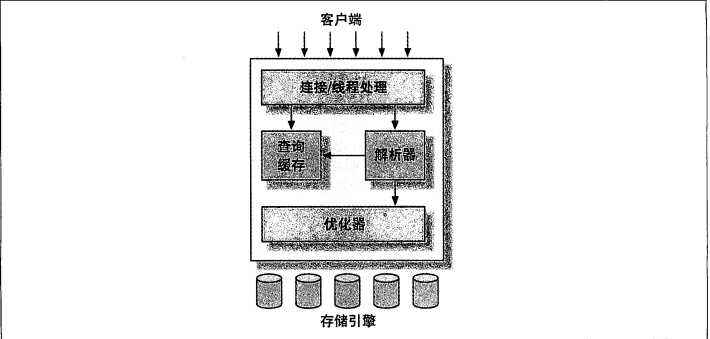

## 第一章 架构

 - 存储引擎不会解析SQL
 - 不同的存储引擎之间无法相互通信
 - 解析SQL发色和嗯在第二层
 - 事务，或者 根据主键提取记录 这种操作发生在存储引擎中，服务器层不管理事务
 
 
 
#### 连接管理 线程模型

每个客户端连接都会在服务端拥有一个线程，
服务端会对这些线程进行缓存，复用（即线程池）
达到使用少量线程来服务大量的客户端连接的目的.

也就是说 一个web站点可能同时有50000个用户并发访问，但是可能只有10-15个并发请求到MySQL服务器。

todo 连接池 与 持久连接的 区别

#### 优化与执行

查询顺序

1 接到客户端请求
2 查看查询缓存中是否有对应的查询结果，如果有 立刻返回 不在进行 sql解析 优化
3 如果没有 则对sql进行解析， 优化

#### 并发控制

多进程同时读写一个文件时，来自不同进程的数据可能会混杂在一起.
解决这类经典问题的方法就是并发控制

在处理并发读或者并发写时,通过实现一个由两种类型的的锁组成的锁系统来解决问题.
这两种类型的锁通称被称为 

 - 共享锁  别名： 读锁
 - 排它锁  别名： 写锁
 
锁的特性

 - 读锁是共享的，允许其它读锁在同一时刻共同读取同一个资源
 - 写锁是排它的，会阻塞其它的写锁或者读锁 

在数据库种，每时每刻都在发生锁定.

#### 锁粒度

锁粒度的大小决定系统的并发性能的高低,尽量精确锁定需要修改的部分,而不是全部数据可以带来更好的并发控制.
但是维护锁也会带来系统开销.所以 所谓的锁策略就是在锁开销与数据的安全性之间寻求一个平衡.

 - table lock   
 - row lock      并发性更好，但是锁开销更大.
 
#### 存储引擎

innodb在新版本中是默认的存储引擎
（因为myisam引擎不支持事务，不支持崩溃后的安全恢复，只有在少量写，数据量较小，可以忍受崩溃后部分数据丢失场景下使用）。
innodb使用MVCC来支持高并发.
innodb表是基于聚簇索引创建的
innodb真正支持热备份

如果在一个事务中需要操作的数据量比较大的话，我们可以考虑将数据分批，
避免大事务产生过多的undo

myisam

myisam最典型的性能问题还是表锁的问题
myisam的索引文件 与 数据文件 是分开存储的

myisam压缩表

如果只读，不更改，那么可以设置为压缩表，可以提升IO性能以及减少磁盘空间占用

人们经常会混淆 mermory 表 与 临时表 

 - 临时表指使用 create temporay table 创建的表，它可以使用任何存储引擎
 只在单个连接中可见，连接断开时 ，临时表销毁
 - memory 是表的存储引擎 数据全部存储在内存中 

#### 事务

在同一个事务中使用多个存储引擎是不可靠的
要避免事务嵌套

MVCC 

innodb下的四种操作

    insert
    select
    update
    delete
    
MVCC 只在  repeatable read与 read commited 两种隔离级别下有效.    