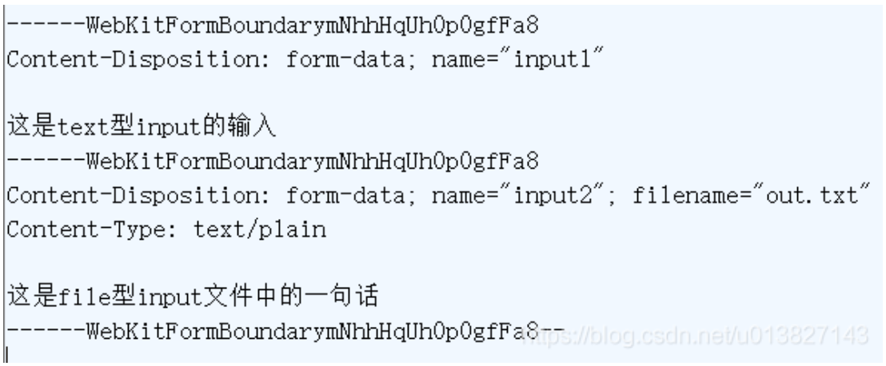
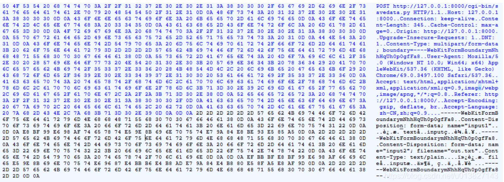

## post使用form-data和x-www-form-urlencoded的本质区别

一是数据包格式的区别，二是数据包中非ANSCII字符怎么编码，是百分号转码发送还是直接发送

##### 一、application/x-www-form-urlencoded

1、它是post的默认格式，使用js中URLencode转码方法。包括将name、value中的空格替换为加号；将非ascii字符做百分号编码；将input的name、value用‘=’连接，不同的input之间用‘&’连接。
2、百分号编码什么意思呢。比如汉字‘丁’吧，他的utf8编码在十六进制下是0xE4B881，占3个字节，把它转成字符串‘E4B881’，变成了六个字节，每两个字节前加上百分号前缀，得到字符串“%E4%B8%81”，变成九个ascii字符，占九个字节（十六进制下是0x244534254238253831）。把这九个字节拼接到数据包里，这样就可以传输“非ascii字符的  utf8编码的 十六进制表示的 字符串的 百分号形式”，^_^。
3、同样使用URLencode转码，这种post格式跟get的区别在于，get把转换、拼接完的字符串用‘?’直接与表单的action连接作为URL使用，所以请求体里没有数据；而post把转换、拼接后的字符串放在了请求体里，不会在浏览器的地址栏显示，因而更安全一些。

##### 二、multipart/form-data

1、对于一段utf8编码的字节，用application/x-www-form-urlencoded传输其中的ascii字符没有问题，
但对于非ascii字符传输效率就很低了（汉字‘丁’从三字节变成了九字节），因此在传很长的字节（如文件）时应用multipart/form-data格式。smtp等协议也使用或借鉴了此格式。

2、此格式表面上发送了什么呢。用此格式发送一段一句话和一个文件，请求体如下

同时请求头里规定了`Content-Type: multipart/form-data; boundary=----WebKitFormBoundarymNhhHqUh0p0gfFa8`

可见请求体里不同的input之间用一段叫boundary的字符串分割，每个input都有了自己一个小header，其后空行接着是数据。

3、此格式实际上发送了什么呢。fiddler抓包如下

右边明显看到了一段乱码，为什么呢，以汉字‘丁’为例，其utf8编码为0xE4B881，这三个字节会直接拼接到数据包中，即其在实际发送时只占三字节，
上图右边是逐字节转为ascii字符显示的，因此会显示为三个乱码字符。

由上可见，`multipart/form-data`将表单中的每个input转为了一个由boundary分割的小格式，没有转码，直接将utf8字节拼接到请求体中，
在本地有多少字节实际就发送多少字节，极大提高了效率，适合传输长字节。

## Question 

 - raw 可以上传任意格式的文本，可以上传text、json、xml、html等
 - 相当于Content-Type:application/octet-stream,从字面意思得知，只可以上传二进制数据，通常用来上传文件，由于没有键值，所以，一次只能上传一个文件。如果要上传多个文件.需要使用`multipart/form-data`.

multipart/form-data与x-www-form-urlencoded区别

 - multipart/form-data：既可以上传文件等二进制数据，也可以上传表单键值对，只是最后会转化为一条信息；
 - x-www-form-urlencoded：只能上传键值对，并且键值对都是间隔分开的。

## 参考资料

postman中 form-data、x-www-form-urlencoded、raw、binary的区别 https://blog.csdn.net/wangjun5159/article/details/47781443

post使用form-data和x-www-form-urlencoded的本质区别 https://blog.csdn.net/u013827143/article/details/86222486
